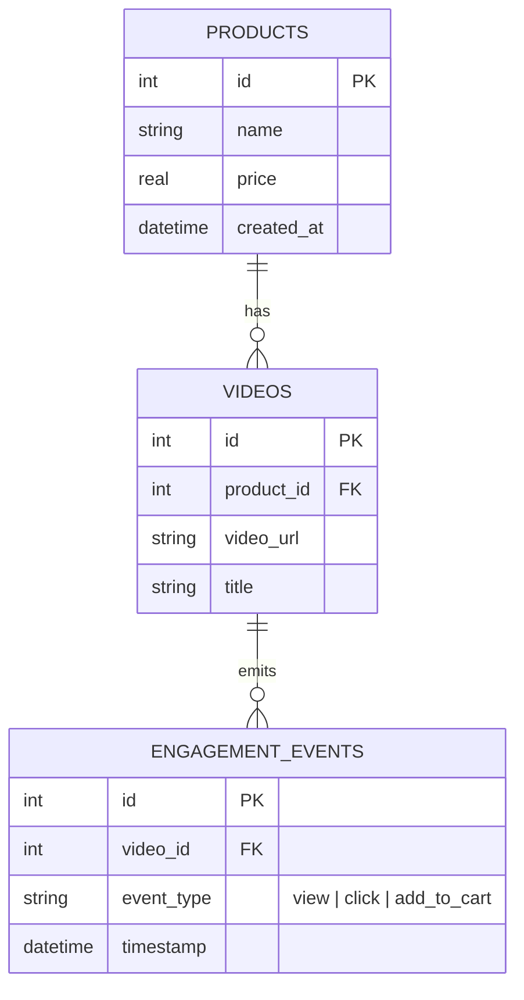

# 🛍️ Shoppable Video Analytics Dashboard

A full-stack dashboard built for tracking shoppable video performance, event telemetry, and conversion analytics. Styled with a high-end Stripe/Linear aesthetic using native CSS Modules.

---

## 🚀 Architectural Tradeoffs & Engineering Decisions

### 1. SQL Aggregation Strategy & Cartesian Product Prevention
To aggregate engagement events per video without inflating metric totals:
```sql
SELECT 
  v.id,
  v.title,
  v.video_url,
  v.product_id,
  p.name AS product_name,
  p.price AS product_price,
  COALESCE(agg.views, 0) AS views,
  COALESCE(agg.clicks, 0) AS clicks,
  COALESCE(agg.add_to_cart, 0) AS add_to_cart
FROM videos v
INNER JOIN products p ON v.product_id = p.id
LEFT JOIN (
  SELECT 
    video_id,
    SUM(CASE WHEN event_type = 'view' THEN 1 ELSE 0 END) AS views,
    SUM(CASE WHEN event_type = 'click' THEN 1 ELSE 0 END) AS clicks,
    SUM(CASE WHEN event_type = 'add_to_cart' THEN 1 ELSE 0 END) AS add_to_cart
  FROM engagement_events
  GROUP BY video_id
) agg ON v.id = agg.video_id
ORDER BY agg.views DESC, v.id ASC
LIMIT ? OFFSET ?;
```
> **Tradeoff Rationale:** A naive multi-JOIN across event types (joining `engagement_events` 3 separate times for views, clicks, and carts) generates a Cartesian product multiplier (e.g. 20 views * 10 clicks * 5 carts = 1,000 intermediate rows per video). By grouping in a single subquery with conditional aggregation (`SUM(CASE WHEN event_type = ...)`), SQLite aggregates events in a single scan pass without row count inflation.

### 2. Indexing Strategy & EXPLAIN QUERY PLAN
We created a composite covering index `idx_events_video_type` on `engagement_events(video_id, event_type)`.

```plain
EXPLAIN QUERY PLAN Output:
-----------------------------------------------------------------------------
1. MATERIALIZE agg
2. SCAN engagement_events USING COVERING INDEX idx_events_video_type
3. SCAN v USING INDEX idx_videos_product_id
4. SEARCH p USING INTEGER PRIMARY KEY (rowid=?)
5. BLOOM FILTER ON agg (video_id=?)
6. SEARCH agg USING AUTOMATIC COVERING INDEX (video_id=?) LEFT-JOIN
7. USE TEMP B-TREE FOR ORDER BY
-----------------------------------------------------------------------------
```
> **Verification:** SQLite performs a **COVERING INDEX SCAN** over `(video_id, event_type)` to compute the subquery directly from the index B-Tree, completely bypassing disk table row reads.

### 3. Styling Paradigm: CSS Modules
> Native CSS Modules (`*.module.css`) was selected over Tailwind CSS or `styled-components` for zero runtime JavaScript overhead, strict component-level encapsulation without global namespace pollution, and zero vendor build-step lock-in.

---

## 📊 Database Schema (3NF)



---

## ⚡ Quick Start & Setup

### 1. Clone & Install Dependencies
```bash
git clone <your-repository-url>
cd reality-shop
npm run install:all
```

### 2. Seed Database (Idempotent)
Populates SQLite with 8 products, 15 videos, and ~470 engagement events distributed across the past 30 days.
```bash
npm run seed
```

### 3. Run Development Servers
Starts Express backend (`http://localhost:5000`) and Vite React frontend (`http://localhost:3000` / `3001`) concurrently:
```bash
npm run dev
```

---

## 📡 API Documentation & Error Contracts

### 1. `POST /api/events`
Record a new user engagement event (`view`, `click`, or `add_to_cart`).

* **Valid Payload (201 Created):**
  ```json
  { "videoId": 1, "eventType": "add_to_cart" }
  ```
* **Invalid Video ID (404 Not Found):**
  ```json
  { "error": "Not Found", "message": "Video with ID 99999 was not found." }
  ```
* **Invalid Event Type (400 Bad Request):**
  ```json
  { "error": "Bad Request", "message": "Field \"eventType\" must be one of: view, click, add_to_cart." }
  ```
* **Malformed JSON Body (400 Bad Request):**
  ```json
  { "error": "Bad Request", "message": "Invalid JSON payload provided in request body." }
  ```

---

### 2. `GET /api/analytics/videos`
Fetch paginated video engagement metrics with product details.

* **Out-of-Bounds Page Handling (`?page=999&limit=10`):**
  Returns status `200 OK` with an empty data array and valid pagination metadata:
  ```json
  { "data": [], "page": 999, "limit": 10, "total": 15, "totalPages": 2 }
  ```

---

## ⚠️ Known Limitations & Future Enhancements

1. **Offset-Based Pagination:** The current endpoint uses standard SQL `LIMIT / OFFSET`. For massive event tables (>1M rows), offset queries degrade in performance. A production system at scale would migrate to keyset/cursor-based pagination (`WHERE id > last_seen_id LIMIT N`).
2. **Polling vs. WebSockets / Server-Sent Events (SSE):** Traffic simulation updates are fetched via client polling/trigger. A production dashboard would use SSE or WebSocket connections for true real-time metric broadcasting.
3. **Authentication & Authorization:** The current API endpoints are public for demonstration purposes. A production application would enforce JWT or session-based auth with RBAC (Role-Based Access Control) on event ingestion and analytics endpoints.
